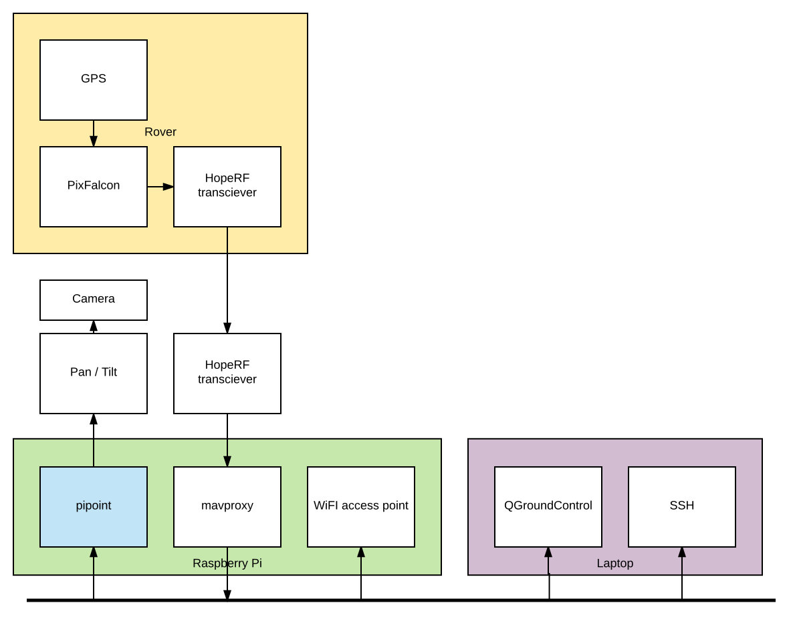

# pipoint - a PX4 based camera pointer.

Some time ago I set up a camera, pointed it at the sky, and recorded
as I flew my model plane about.  It was quite cool, but the plane
covers so much area that most of the video was of blue sky.

PiPoint solves this problem by automatically pointing a ground based
camera at the rover using GPS, a telemtry link, and pan/tilt unit.

## Implementation

The system consists of:

On the rover:

* a [PixFalcon Micro](https://hobbyking.com/en_us/pixfalcon-micro-px4-autopilot-plus-micro-m8n-gps-and-mega-pbd-power-module.html)
* GPS
* [SiK radio](https://hobbyking.com/en_us/hkpilot-transceiver-telemetry-radio-set-v2-433mhz.html)
  for telemetry

In the base station:

* a [Rasperry Pi 3](https://www.raspberrypi.org/products/raspberry-pi-3-model-b/)
* SiK radio for telemetry
* a [Lynx B servo based pan and tilt kit](http://www.lynxmotion.com/p-287-lynx-b-pan-and-tilt-kit-black-anodized.aspx)
* a [Turnigy 2K HD actioncam](https://hobbyking.com/en_us/turnigy-2k-hd-camera-black-edition-lite-package.html)
* A laser cut camera adaptor
* A extra wifi USB adapter for the home network
* A Linux laptop for display and control

Assembling this is left as an exercise for the reader :)  There are some
photos on [my blog](https://juju.net.nz/michaelh/blog/).

## Build

* See `hardware/` and
  [https://www.tinkercad.com/dashboard/search?q=pipoint](Tinkercad)
  for the camera adapter.
* See `ansible/` for rules to set up the Raspberry Pi.
* See `etc/` for files used on the PX4 or Raspberry Pi.  Copy
  `extra.txt` to `etc/extra.txt` on the PixFalcon SD card.
* See `Makefile` for shortcuts to build pipoint itself.

# Note
This is not an official Google product.

-- Michael Hope <michaelh@juju.net.nz> <mlhx@google.com>
